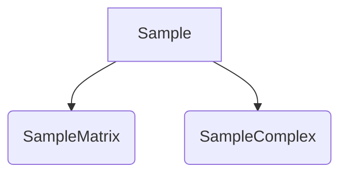

# Лабораторная работа №3, часть 2 и 3

## Часть 2: Реализация классов SampleMatrix и SampleComplex

Данная часть лабораторной работы предполагает реализацию классов `SampleMatrix` и `SampleComplex`.

### Диаграмма классов:

## Часть 3: Подключение библиотек boost и FFTW

Для выполнения части 3 лабораторной работы необходимо выполнить следующие шаги:

1. Подключить библиотеки `boost` и `FFTW` (см. [тут](http://www.boost.org/) и [тут](https://www.fftw.org/install/windows.html) - сайты производителей для инструкций по установке).
2. Сравнить перемножение матриц с использованием своего проекта и библиотеки `boost::numeric::ublas`.
3. Выполнить преобразование Фурье от двумерной комплексной выборки `SampleComplex` размером 512x512, заполненной единичными значениями, и вывести результат в файл.
4. Результатом должна быть дельта-функция, если не было выполнено сдвига, то в элементе (0,0).
